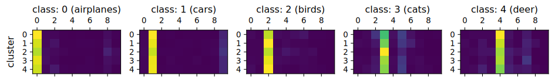
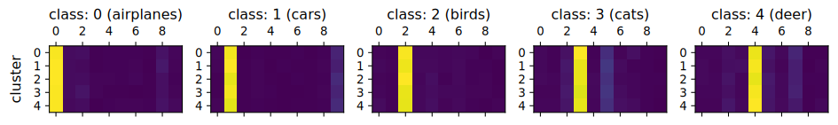
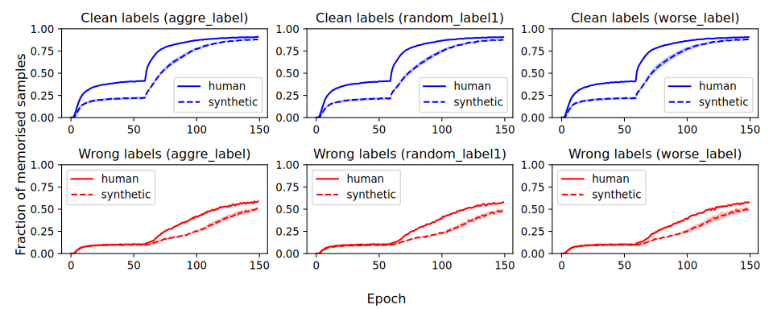

# Reproduction of "*Learning with Noisy Labels Revisited: A Study Using Real-World Human Annotations*"

## About

This is the repository for our reproduction of the paper "[*Learning with Noisy Labels Revisited: A Study Using Real-World Human Annotations*](https://openreview.net/forum?id=TBWA6PLJZQm)".

We implement and test the following experiments:

1) Noise hypothesis testing (section 4.2. in the original publication). With this experiment, the authors claim that real-world noisy labels differ significantly from their synthetic counterparts. We confirm their claim, albeit with slightly different results.




<p style="text-align: center;">Transition vectors within real-world (top) and synthetic (bottom) clusters for <i>Random1</i> label</p>

2) Noise memorization effects (section 5.2. in the original publication). The authors claim that models start to overfit on the real-world noisy labels faster than on their synthetic counterparts, indicating a harder learning task. We confirm their claim.


<p style="text-align: center;">Noise memorisation effects.</p>

3) Benchmark of LNL approaches (section 5.1. in the original publication). The authors claim that LNL approaches perform worse on real-world noisy labels than on their synthetic counterparts. We confirm their claim, but not with their supposed hyperparameter setup.

| Method       | Clean                         | Aggregate                     | Random 1                      | Random 2                      | Random 3                      | Worst                         | Clean                         | Noisy                         |
|--------------|-------------------------------|-------------------------------|-------------------------------|-------------------------------|-------------------------------|-------------------------------|-------------------------------|-------------------------------|
| CE           | $94.21 \pm 0.12$              | $91.70 \pm 0.07$              | $90.20 \pm 0.04$              | $90.12 \pm 0.13$              | $90.08 \pm 0.05$              | $83.91 \pm 0.08$              | $76.23 \pm 0.19$              | $61.19 \pm 0.51$              |
| Co-teaching  | $92.15 \pm 0.11$              | $91.93 \pm 0.25$              | $90.69 \pm 0.07$              | $90.51 \pm 0.14$              | $90.56 \pm 0.22$              | $80.92 \pm 0.43$              | $72.24 \pm 0.44$              | $54.48 \pm 0.27$              |
| Co-teaching+ | $92.90 \pm 0.22$              | $91.15 \pm 0.08$              | $89.82 \pm 0.13$              | $89.64 \pm 0.19$              | $89.77 \pm 0.26$              | $82.36 \pm 0.04$              | $70.39 \pm 0.45$              | $55.46 \pm 0.34$              |
| ELR          | $93.97 \pm 0.12$              | $93.00 \pm 0.19$              | $92.20 \pm 0.10$              | $92.05 \pm 0.12$              | $92.18 \pm 0.17$              | $87.89 \pm 0.14$              | $75.64 \pm 0.21$              | $63.72 \pm 0.38$              |
| ELR+         | $95.81 \pm 0.16$              | $95.32 \pm 0.06$              | $94.89 \pm 0.11$              | $94.88 \pm 0.08$              | $94.93 \pm 0.07$              | $91.75 \pm 0.06$              | $\boldsymbol{78.82 \pm 0.24}$ | $67.87 \pm 0.07$              |
| DivideMix    | $95.51 \pm 0.00$              | $95.62 \pm 0.09$              | $\boldsymbol{95.72 \pm 0.11}$ | $\boldsymbol{95.78 \pm 0.10}$ | $95.71 \pm 0.09$              | $\boldsymbol{93.10 \pm 0.10}$ | $78.22 \pm 0.06$              | $\boldsymbol{70.91 \pm 0.09}$ |
| VolMinNet    | $92.71 \pm 0.02$              | $90.47 \pm 0.17$              | $88.90 \pm 0.51$              | $88.81 \pm 0.17$              | $88.67 \pm 0.10$              | $80.87 \pm 0.25$              | $72.73 \pm 0.65$              | $58.30 \pm 0.05$              |
| CAL          | $93.78 \pm 0.18$              | $91.84 \pm 0.23$              | $91.10 \pm 0.26$              | $90.60 \pm 0.10$              | $90.61 \pm 0.12$              | $84.82 \pm 0.23$              | $74.53 \pm 0.21$              | $60.13 \pm 0.33$              |
| PES (semi)   | $94.75 \pm 0.16$              | $94.64 \pm 0.05$              | $95.20 \pm 0.08$              | $95.26 \pm 0.13$              | $95.20 \pm 0.11$              | $92.58 \pm 0.05$              | $77.77 \pm 0.33$              | $70.32 \pm 0.28$              |
| SOP+         | $\boldsymbol{96.53 \pm 0.05}$ | $\boldsymbol{96.04 \pm 0.15}$ | $95.70 \pm 0.07$              | $95.62 \pm 0.18$              | $\boldsymbol{95.75 \pm 0.14}$ | $92.89 \pm 0.09$              | $77.90 \pm 0.29$              | $63.88 \pm 0.32$              |
| SOP          | $93.76 \pm 0.26$              | $91.69 \pm 0.76$              | $89.83 \pm 0.24$              | $90.57 \pm 0.46$              | $90.88 \pm 0.15$              | $83.66 \pm 0.64$              | $72.97 \pm 1.15$              | $56.17 \pm 1.02$              |

<p style="text-align: center;">Our results on the real-world noise (CIFAR-10N and CIFAR-100n)</p>

## Installation
```bash
conda create -n noisylables python=3.10
conda activate noisylabels
pip install .
```

## How to run?

To rerun our experiments, refer to `src/reproducibility` folder:
* To rerun the hypothesis testing experiment, run the `hypothesis_testing.ipynb` notebook within the `noise_hypothesis_testing` folder.
* To rerun noise memorisation experiment, run either the `memorization.ipynb` notebook or `memo.py` script within `memorization_effects` folder.
* To rerun the benchmark experiments, run `main_paper.py`(authors' claimed hyperparameter setup with CIFAR-10) `main.py`(original hyperparameter setup with CIFAR-10) `main_cifar100n.py`(original hyperparameters with CIFAR-100)


## Repository structure

The repository is more or less following the [Data Science Cookie Cutter project structure](https://drivendata.github.io/cookiecutter-data-science/)

Briefly:
- `article` - Article and figures.
- `src` - Everything code
  - `noisypy` - Python package for working with LNL methods.
  - `reproducibility` - Experiments for reproducibility challenge submission.
    - `learning_strategies` - Experiments to verify our implementations for each LNL method.
    - `logs` - Results of our experiments.
    - `memorization_effects` - Memorization effects experiment - see `memorization.ipynb` and `memo.py`.
    - `noise_hypothesis_testing` - Noise clustering hypothesis testing experiment - see `hypothesis_testing.ipynb`.
    - `noisy_labels` - Benchmark reproduction. `main.py` is for normal CIFAR-10N human and synthetic runs (`--synthetic` switch to run synthetic versions). `main_cifar100n.py` same thing for CIFAR-100N. `main_paper.py` runs CIFAR-10N authors claimed configs (with fixed learning rate, schedulers and optimizers).
- `tests` - Unit tests for some of the package modules.
